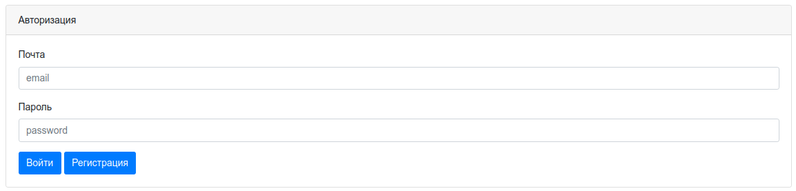
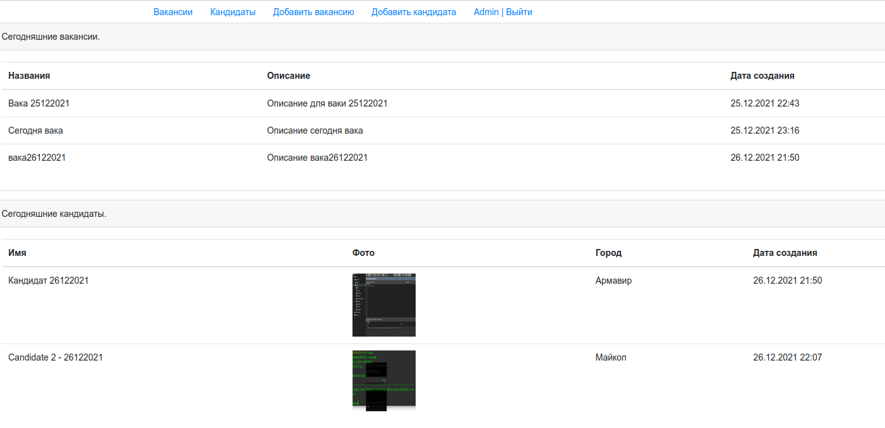
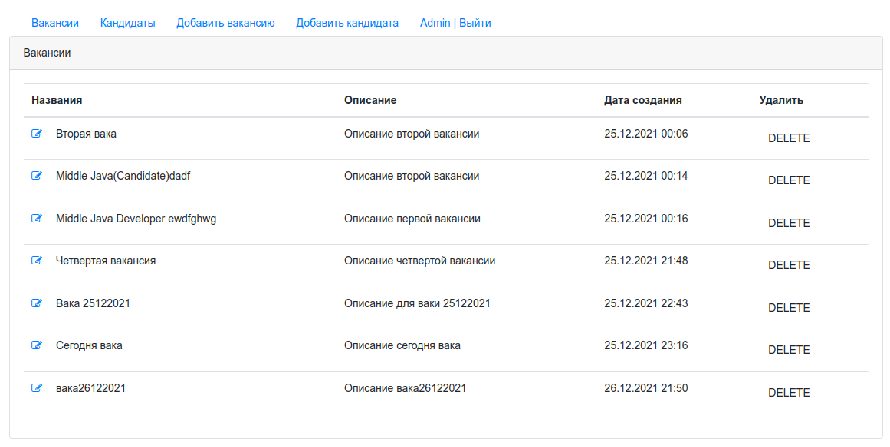
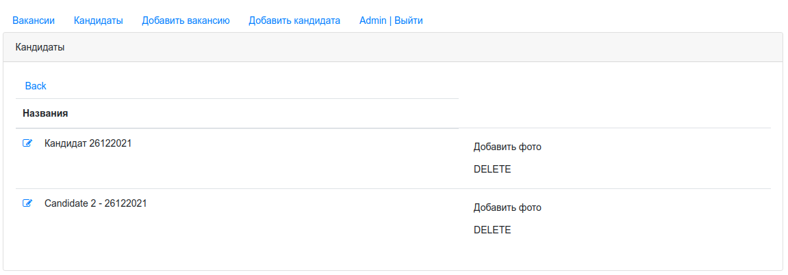
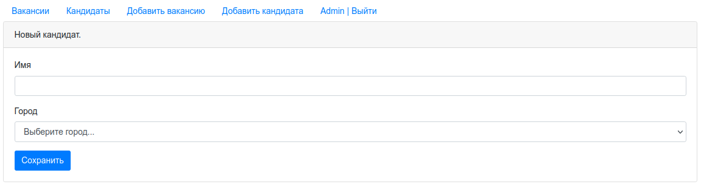
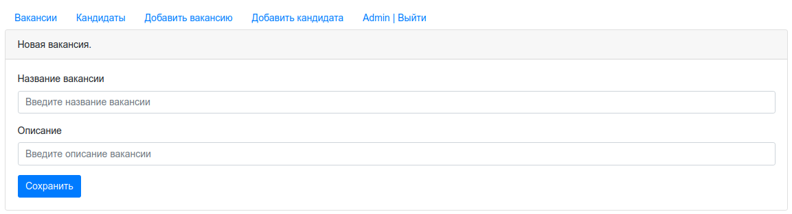

# job4j_dreamjob

## Проект - DreamJob - Servlets 
_В блоке servlet мы будем разрабатывать приложение биржу работы_
 В системе будут два типа пользователей: кандидаты и кадровики. Кандидаты будут публиковать резюме. Кадровики будут публиковать вакансии о работе.
 <i><h4>Страница авторизации

 <i><h4>Главная страница

 <i><h4>Страница вакансий

 <i><h4>Страница кандидатов

 <i><h4>Страница добавления кандидатов

 <i><h4>Страница добавления вакансии

Кандидаты могут откликнуться на вакансию. Кадровик может пригласить на вакансию кандидата.
## Сборка и запуск 
для сборки `mvn install` 
для запуска`java -jar target/job4j_dreamjob-1.0.jar`

## Как использовать. 
Использовать для threads

## Контакты для связи 
 arvikvan@gmail.com 
 @ArvikV

##Используемые технологии:
- Maven
- Java EE Servlet API
- JDBC
- PostgreSQL
- Travis CI
- Apache Tomcat
- Java Script

